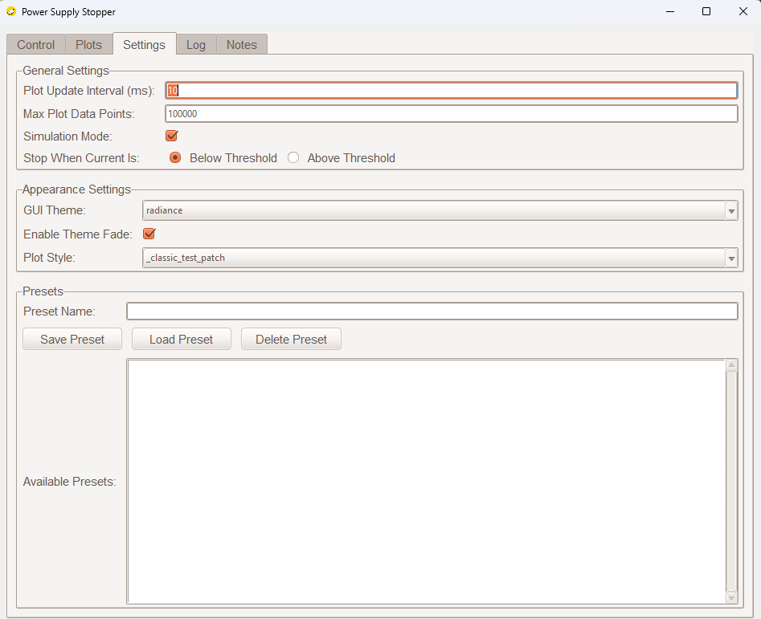
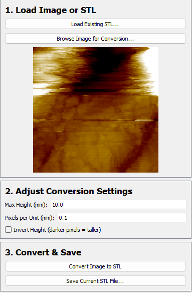
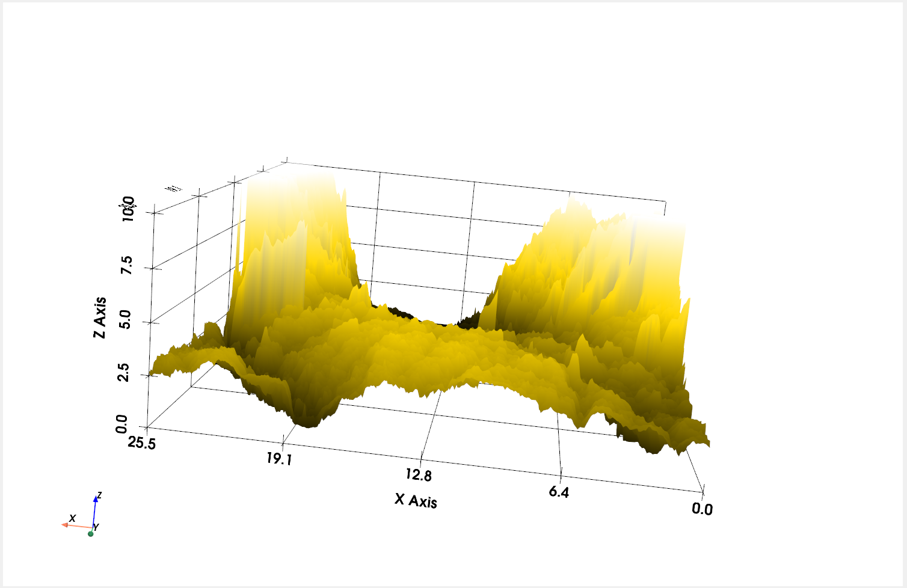

# Rigol Power Supply Automation and logging scirpt and converting TIFFs to STL 

This repository contains Python scripts designed to be used for manufacturing tip etching and examining TIFF STM outputs 

## Scripts

### 1. `Power Supply Stopper.py`

* **Purpose:** This script provides a comprehensive Tkinter-based GUI for controlling a programmable power supply. It offers more advanced features, including preset management, configurable export formats, detailed logging, and a more interactive user experience.
* **Key Features:**
    * **GUI Interface:** User-friendly interface built with Tkinter and ttkthemes.
    * **VISA Resource Scanning:** Automatically scans for and lists available VISA instruments.
    * **Configurable Parameters:** Allows setting of voltage, current, and stop threshold; supports above/below stop condition.
    * **Real-time Plotting:** Live plots for Voltage, Current, Power, and Resistance. Plot style is configurable.
    * **Data Logging & Export:**
        * Logs all data points in memory during the session.
        * Exports data to CSV, XLSX (Excel), or JSON formats.
        * Includes configuration settings and user notes in exported files.
    * **Preset Management:** Save and load configurations for different experimental setups.
    * **Simulation Mode:** Allows running the application without a physical instrument for testing or demonstration.
    * **Notes Section:** Add and save notes related to the experiment, which are included in data exports.
    * **Electrochemical Cell Information:** Fields to input Anode, Cathode, Electrolyte, and Molarity details, which are saved with the data.
    * **Status & Log Tabs:** Provides real-time status updates and a detailed event log.
    * **Customizable Appearance:** Selectable GUI themes and plot styles.
* **Usage:**
    1.  Ensure all dependencies are installed.
    2.  Run the script: `python "Power Supply Stopper.py"`
    3.  **Control Tab:**
        * Scan for VISA resources.
        * Set the desired Voltage, Current, and Stop Threshold.
        * Choose the save location for exported data.
        * Select the export format (CSV, XLSX, JSON, or All).
        * Optionally, fill in electrochemical cell information.
    4.  **Settings Tab:**
        * Configure plot update interval, max plot points, GUI theme, plot style.
        * Enable/disable simulation mode.
        * Set the stop condition (current below or above threshold).
        * Manage presets (save, load, delete).
    5.  **Notes Tab:** Add any relevant experimental notes. These will be saved with the configuration and included in data exports.
    6.  Click "Start Logging". The application will switch to the "Plots" tab.
    7.  Click "Stop Logging" to end the experiment. Data will be exported according to the selected format and settings.
    8.  The "Log" tab shows a history of operations and events.
* **Dependencies:**
    * `tkinter` (usually part of Python's standard library)
    * `pyvisa` (for instrument communication)
    * `pandas` (for XLSX and JSON export)
    * `openpyxl` (for XLSX export, used by pandas)
    * `numpy` (for numerical operations, especially in plotting)
    * `matplotlib` (for plotting)
    * `ttkthemes` (optional, for enhanced GUI styling; falls back to default Tkinter styles if not found)
    * `Pillow` (PIL) (optional, for using `.ico` window icons; falls back if not found)
    * `winsound` (optional, for beep sound on Windows when threshold is met; script runs on other OS without it)
    * `psutil` System monitoring (CPU, battery, process stats) for optional integration
    * `zeroconf`  Future-ready support for auto-discovery of networked instruments and devices
    * `pyvisa-py`  Backend for pyvisa (pure Python implementation, no NI-VISA needed).
```bash
pip install tkinter pyvisa pandas openpyxl numpy matplotlib ttkthemes Pillow winsound psutil zeroconf pyvisa-py
```
   * Limitation 
   It must be noted that when decreasing the logging time, down to 10ms, this will increase the plotting time, but will hold no bearing on the logging on exporting the file in JSON, CSV or XlSX.

Having only had access to one power supply I can only assure success with the RIGOL DP 811A power supplu

### 2. `Tiff_to_STL_converter & viewer.py`
* **Purpose:** This Python application provides a user-friendly Graphical User Interface (GUI) for converting 2D images (like TIFFs, PNGs, JPEGs) into 3D STL models based on heightmap data. It also includes a built-in 3D viewer to visualise both converted models and existing STL files.


* **Key Features:**
    * **Image to STL Conversion:**  Transform grayscale images into 3D heightmap models. Users can choose whether darker or lighter pixels correspond to taller features
    * **STL File Viewer:** Load and inspect existing .stl files directly within the application.
    * **Configurable Conversion Settings:** Allows setting of voltage, current, and stop threshold; supports above/below stop condition.
         * **Max Height (mm):** Define the maximum Z-height of the generated 3D model.
         * **Pixels per Unit (mm):** Control the real-world scale of the 3D model relative to image pixels.
         * **Invert Height:*** Option to invert the height mapping, making darker pixels taller instead of brighter ones.  
    * **Real-time 3D Visualisation:** Utilizes PyVista for interactive 3D rendering of the converted or loaded STL models.
    * **Automatic Z-Height Colouring:** Models are automatically coloured in the viewer based on their Z-axis height, using a gradient from black (low) to white (high) with a gold midpoint.
    * **Save Functionality:"" Save the generated or loaded 3D models as new .stl files.
* **Usage:**
    1.  Ensure all dependencies are installed.
    2.  Run the script: `Tiff_to_STL_converter & viewer.py"`
    3.  **Load Image or STL:**
        * Click the "Browse Image for Conversion..." button to select a 2D image file (e.g., .png, .jpg, .tif). A preview of the selected image will appear
        * Alternatively, click "Load Existing STL..." to open and display a pre-existing .stl file directly in the 3D viewer 
    4.  **Adjust Conversion Settings (for image conversion):**
        * Max Height (mm): Input the desired maximum height for the 3D model in millimetres
        * Pixels per Unit (mm): Specify the real-world dimension that each pixel in your image represents (e.g., 0.1 means 10 pixels will equate to 1 millimetre in the 3D model).
        * Invert Height: Check this box if you want darker areas of your image to correspond to taller features in the generated 3D model 
    5.  **Convert Image to STL:** After loading an image and configuring the settings, click "Convert Image to STL". The application will process the image and render the resulting 3D model in the integrated viewer
    6.  Save STL File: Once a model is displayed in the viewer (either newly converted or loaded), click "Save Current STL File" to save it to your chosen location on your system 
    7.   Click "Stop Logging" to end the experiment. Data will be exported according to the selected format and setting
    8.    3D Viewer Interaction: Use your mouse to freely rotate, pan, and zoom the 3D model within the viewer.

* **Dependencies:**
    * `PyQt5:` The framework used for building the graphical user interface.
    * `Pillow` (PIL) For opening and processing various image formats
    * `numpy`  Essential for numerical operations and array manipulations, especially for heightmap and mesh data.
    * `numpy-stl`  For creating and saving STL mesh files.
    * `pyvista` A powerful library for 3D plotting and mesh analysis, used for rendering the STL models.
    * `pyvistaqt` Integrates PyVista's 3D plotting capabilities with PyQt5 applications.
```bash
pip install PyQt5 Pillow numpy numpy-stl pyvista pyvistaqt
```

### Screenshots of Programs

### Power Supply Control Tab 1


### Power Supply Control Tab 2


### Real-time Plotting


### Image to STL Conversion


### 3D Model Viewer



