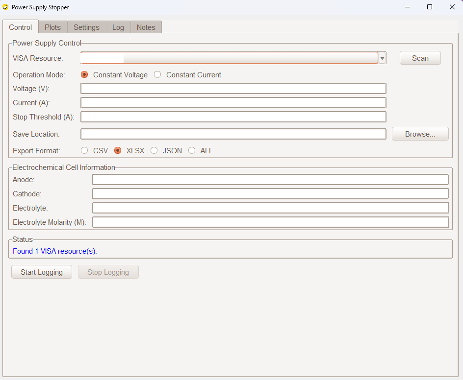
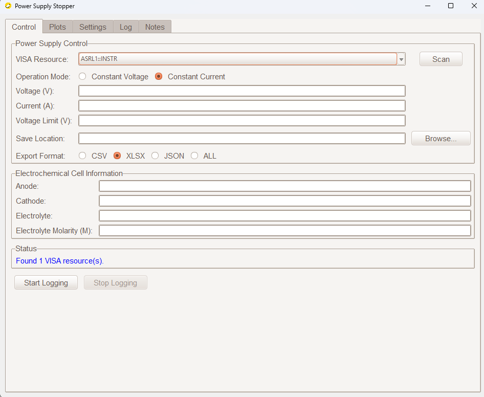
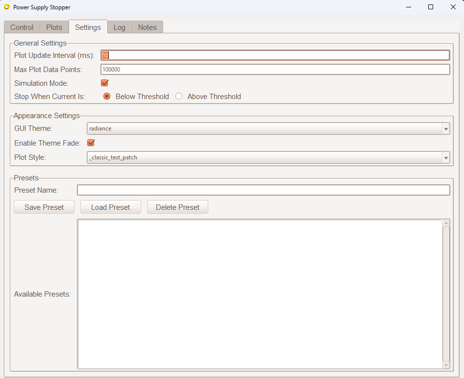
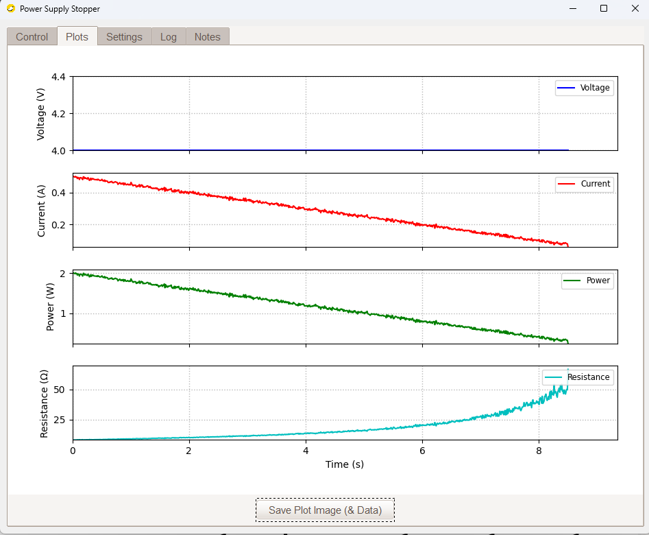

# Rigol Power Supply Automation and Logging Script

This repository contains Python scripts designed for use in manufacturing tip etching, specifically for controlling a Rigol DP811A power supply (though the core logic can be adapted for other VISA-compatible instruments).

## Scripts

### 1. `Power Supply Stopper.py`

* **Purpose:** This script provides a comprehensive Tkinter-based GUI for controlling a programmable power supply. It offers advanced features, including preset management, configurable export formats, detailed logging, and a more interactive user experience for electrochemical etching experiments.

* **Key Features:**
    * **GUI Interface:** User-friendly interface built with Tkinter and `ttkthemes`.
    * **VISA Resource Scanning:** Automatically scans for and lists available VISA instruments.
    * **Configurable Parameters:** Allows setting of voltage, current, and stop threshold; supports `above` or `below` stop conditions.
    * **Real-time Plotting:** Live plots for Voltage, Current, Power, and Resistance. Plot style is configurable.
    * **Data Logging & Export:**
        * Logs all data points in memory during the session.
        * Exports data to CSV, XLSX (Excel), or JSON formats.
        * Includes configuration settings and user notes in exported files.
    * **Preset Management:** Save and load configurations for different experimental setups.
    * **Simulation Mode:** Enables running the application without a physical instrument for testing or demonstration purposes.
    * **Notes Section:** Add and save notes related to the experiment, which are included in data exports.
    * **Electrochemical Cell Information:** Fields to input Anode, Cathode, Electrolyte, and Molarity details, which are saved with the data.
    * **Status & Log Tabs:** Provides real-time status updates and a detailed event log.
    * **Customizable Appearance:** Selectable GUI themes and plot styles.

* **Usage:**
    1.  Ensure all dependencies are installed.
    2.  Run the script: `python "Power Supply Stopper.py"`
    3.  **Control Tab:**
        * Scan for VISA resources.
        * Set the desired Voltage, Current, and Stop Threshold.
        * Choose the save location for exported data.
        * Select the export format (CSV, XLSX, JSON, or All).
        * Optionally, fill in electrochemical cell information.
    4.  **Settings Tab:**
        * Configure plot update interval, max plot points, GUI theme, and plot style.
        * Enable/disable simulation mode.
        * Set the stop condition (current below or above threshold).
        * Manage presets (save, load, delete).
    5.  **Notes Tab:** Add any relevant experimental notes. These will be saved with the configuration and included in data exports.
    6.  Click "Start Logging". The application will switch to the "Plots" tab.
    7.  Click "Stop Logging" to end the experiment. Data will be exported according to the selected format and settings.
    8.  The "Log" tab shows a history of operations and events.

* **Dependencies:**
    * `tkinter` (usually part of Python's standard library)
    * `pyvisa` (for instrument communication)
    * `pandas` (for XLSX and JSON export)
    * `openpyxl` (for XLSX export, used by pandas)
    * `numpy` (for numerical operations, especially in plotting)
    * `matplotlib` (for plotting)
    * `ttkthemes` (optional, for enhanced GUI styling; falls back to default Tkinter styles if not found)
    * `Pillow` (PIL) (optional, for using `.ico` window icons; falls back if not found)
    * `winsound` (optional, for beep sound on Windows when threshold is met; script runs on other OS without it)
    * `psutil` (Optional: System monitoring, not directly used in the provided script but listed in original dependencies)
    * `zeroconf` (Optional: For auto-discovery of networked instruments, not directly used in the provided script but listed in original dependencies)
    * `pyvisa-py` (Backend for `pyvisa`, pure Python implementation, no NI-VISA needed).

    You can install all required dependencies using pip:
    ```bash
    pip install pyvisa pandas openpyxl numpy matplotlib ttkthemes Pillow psutil zeroconf pyvisa-py
    ```
    *Note: `tkinter` and `winsound` are usually included with Python installations.*

## Code Explanation: `Power Supply Stopper.py`

The `Power Supply Stopper.py` script is a Python application built with Tkinter that provides a graphical user interface (GUI) for controlling a programmable power supply (specifically tested with Rigol DP811A) and logging its output (voltage, current, power, resistance) over time. It supports real-time plotting, configurable settings, preset management, and data export in multiple formats.

### 1. Imports and Third-Party Libraries

The script starts by importing the necessary modules. It uses `try-except` blocks to handle cases where optional dependencies might not be installed, providing informative error/warning messages:
* **Standard Library Modules**: `tkinter` (for GUI), `messagebox`, `filedialog`, `ttk` (for themed widgets), `StringVar`, `BooleanVar`, `os`, `sys`, `json`, `csv`, `queue`, `threading`, `time`, `traceback`, `datetime`, `collections.deque`, `concurrent.futures.ThreadPoolExecutor`, and `typing` for type hints.
* **Third-Party Libraries (with graceful degradation if not found)**:
    * `winsound`: Used for playing a beep sound when a threshold is met (Windows-specific).
    * `pyvisa`: Essential for communicating with the physical power supply instrument. If not found, simulation mode is still possible.
    * `pandas` and `openpyxl`: Used together for exporting data to XLSX (Excel) and JSON formats. If `pandas` is missing, these export options are disabled.
    * `numpy`: Critical for numerical operations, especially in plotting.
    * `matplotlib`: Used for creating and updating real-time plots within the GUI. It's set to use the `TkAgg` backend for Tkinter integration.
    * `ttkthemes`: Provides enhanced GUI styling and themes. If not found, it falls back to default Tkinter styles.
    * `Pillow` (PIL): Optional, used for loading window icons (e.g., `.ico` files).

### 2. Constants

A comprehensive set of constants defines various application parameters, file names, UI settings, and operational modes:
* **File Names**: `DEFAULT_CONFIG_FILENAME` and `DEFAULT_PRESETS_FILENAME` specify where application settings and saved presets are stored.
* **GUI Defaults**: `DEFAULT_GUI_THEME`, `DEFAULT_PLOT_STYLE`, `DEFAULT_EXPORT_FORMAT`, and `VALID_EXPORT_FORMATS` define initial appearance and export options.
* **Status Indicators**: `STATUS_INFO`, `STATUS_SUCCESS`, `STATUS_WARNING`, `STATUS_ERROR` are used for categorising messages displayed in the Log tab.
* **Performance/Plotting**: `MIN_UPDATE_INTERVAL_MS`, `MIN_PLOT_POINTS`, `PLOT_FIGURE_SIZE`, `PLOT_RECT_MARGIN` ensure consistent data acquisition and plot rendering.
* **UI Layout**: Constants like `UI_PADDING_X`, `FRAME_PADDING_Y_TOP`, `WIDGET_PADDING_X`, `GRID_STICKY_EW`, and `FRAME_STYLE` standardize the spacing and appearance of GUI elements.
* **Instrument Communication**: `VISA_OPEN_TIMEOUT_MS`, `VISA_READ_WRITE_TIMEOUT_MS`, and `INITIAL_SETTLING_TIME_S` configure timeouts for PyVISA operations.
* **Configuration Keys**: A series of `CONFIG_` constants (e.g., `CONFIG_VOLTAGE`, `CONFIG_CURRENT`, `CONFIG_THRESHOLD`, `CONFIG_SIMULATION_MODE`, `CONFIG_NOTES`, `CONFIG_OPERATION_MODE`) are used as dictionary keys for storing and retrieving application settings, ensuring consistency.
* **Operation Modes**: `MODE_CONSTANT_VOLTAGE` and `MODE_CONSTANT_CURRENT` define the supported operational modes for the power supply.

### 3. `Tooltip` Class

This helper class creates transient pop-up windows that appear when the user hovers over a Tkinter widget. It provides a brief descriptive text, improving user experience by explaining the function of various GUI elements.

### 4. `ConfigManager` Class

The `ConfigManager` is responsible for the persistent storage and retrieval of the application's settings and user-defined presets.
* **Initialisation**: It sets up default configuration values (e.g., initial voltage, current, save location) and then attempts to load existing settings from `power_logger_config.json` and presets from `power_logger_presets.json`.
* **`load_config()` and `save_config()`**: These methods handle reading and writing the main configuration dictionary to a JSON file. It merges loaded settings with defaults, allowing for backward compatibility if new settings are added.
* **Preset Management**: `load_presets()`, `add_preset()`, `get_preset()`, `delete_preset()`, and `get_preset_names()` provide functionality for users to save, load, and manage groups of settings (like voltage, current, threshold, electrochemical cell details) for different experimental setups. Presets are also stored in a JSON file.
* **Notes Management**: `get_notes()` and `save_notes()` handle the content of the user notes section, which is stored within the main configuration.

### 5. `DataManager` Class

This class efficiently manages the data points collected for real-time plotting.
* It uses `collections.deque` (double-ended queue) with a `maxlen` (maximum length). This is crucial for plotting performance as it automatically discards the oldest data points when new ones are added, maintaining a "sliding window" of data without constantly resizing lists.
* Data points (time, voltage, current, power, resistance) are added to an internal `queue.Queue` by the `DataLogger` thread and then transferred to the `deque`s for plotting by the GUI's update mechanism.

### 6. `DataLogger` Class

The `DataLogger` is a critical component responsible for interacting with the power supply (or simulating it) and managing the data acquisition process in a separate thread to keep the GUI responsive.
* **Initialization**: It receives the application `config`, `data_manager`, and two `queue.Queue` objects (`status_queue`, `error_queue`) for communicating messages back to the GUI's Log tab.
* **`connect()`**: Establishes a connection to the Rigol power supply using `pyvisa` or initialises simulation mode. It handles potential `VisaIOError` exceptions during connection.
* **`_close_connection()`**: Safely closes the instrument connection and ensures the power supply output is turned off.
* **`start()`**: Initiates the data logging process by setting up the power supply (voltage, current, operation mode) and starting a new `threading.Thread` that runs the `_log_data` method.
* **`stop()`**: Stops the logging thread, turns off the instrument output, closes connections, and triggers the data export process. It also includes user notes in the exported files.
* **`_generate_base_filename()`**: Creates a consistent, timestamped filename for exported data files, incorporating voltage and current settings.
* **`_log_data()`**: This is the main data acquisition loop, running in a separate thread.
    * It continuously reads voltage and current from the instrument or generates simulated values.
    * It calculates power and resistance from the measured values.
    * Each collected data point is appended to an in-memory list (`_logged_data`) for full session history and put into the `data_manager`'s queue for real-time plotting.
    * **Threshold Auto-Stop**: It checks if the measured current (for constant voltage mode) or voltage (for constant current mode) crosses a user-defined threshold (above or below). If the threshold is met, it automatically turns off the power supply output, plays a sound, and signals the logging to stop.
    * It includes delays (`time.sleep`) to maintain the configured `UPDATE_INTERVAL`.
* **Static Save Methods (`save_data_to_csv_static`, `save_data_to_excel_static`, `save_data_to_json_static`)**: These methods are responsible for writing the collected data to CSV, XLSX, and JSON files. They also embed the configuration snapshot and user notes as metadata within the exported files.

### 7. `PowerLoggerApp` Class (GUI Implementation)

This is the main Tkinter application class, orchestrating the GUI and integrating all other components.
* **Initialization (`__init__`)**:
    * Sets up the main `ThemedTk` window, title, icon, and handles initial configuration loading.
    * Initialises `ConfigManager`, `DataManager`, and `DataLogger` instances.
    * Creates `queue.Queue` objects (`status_queue`, `error_queue`) for inter-thread communication to update the Log tab.
    * Sets up a `ttk.Notebook` (tabbed interface) to organise different sections of the application.
* **`_create_widgets()`**: This method is responsible for building the entire GUI layout across multiple tabs:
    * **Control Tab (`_create_control_tab`)**: Allows users to input desired voltage, current, and stop threshold. A `ttk.Combobox` lists available VISA resources. Radio buttons for selecting the stop condition ("Below" or "Above") and operation mode ("Constant Voltage" or "Constant Current"). Buttons for choosing the save location, starting/stopping logging, and managing presets. Fields for electrochemical cell information.
    * **Settings Tab (`_create_settings_tab`)**: Controls for plot update interval and maximum plot points. Dropdowns for selecting GUI themes (from `ttkthemes`) and Matplotlib plot styles. A `ttk.Checkbutton` to enable/disable simulation mode. Options for enabling/disabling the GUI theme fade effect.
    * **Plots Tab (`_create_plots_tab`)**: Integrates `matplotlib` figures into the Tkinter GUI using `FigureCanvasTkAgg`. Displays real-time plots of Voltage, Current, Power, and Resistance. Uses `matplotlib.animation.FuncAnimation` to update the plots efficiently.
    * **Log Tab (`_create_log_tab`)**: Displays real-time status and error messages received from the `DataLogger` thread.
    * **Notes Tab (`_create_notes_tab`)**: A large `tk.Text` widget where users can input and save experimental notes.
    * **About Tab (`_create_about_tab`)**: Provides basic information about the application.
* **Event Handlers**: Numerous methods like `_start_logging()`, `_stop_logging()`, `_scan_visa_resources()`, `_select_save_location()`, `_apply_settings()`, `_save_preset()`, `_load_preset()`, `_delete_preset()`, `_update_plot_data()`, `_update_status_bar()` manage user interactions and application logic.
* **Threading**: The GUI remains responsive because data acquisition and instrument communication happen in a separate thread managed by `DataLogger`. The GUI updates itself by periodically checking the `status_queue` and `data_manager.data_queue` using `root.after()`.
* **Error Handling**: The script includes extensive `try-except` blocks to gracefully handle missing dependencies, VISA communication errors, file I/O issues, and other unexpected exceptions, often directing messages to the Log tab or displaying message boxes.
* **Theme Management**: It allows users to dynamically change GUI themes using `ttkthemes` and plot styles using `matplotlib.pyplot.style.use()`. It also includes an optional "fade effect" when changing themes.

### 8. Main Execution Block

The `if __name__ == "__main__":` block is the entry point of the script.
* It sets a custom exception hook (`sys.excepthook`) to display uncaught exceptions in a Tkinter messagebox, making debugging easier for the user.
* It initialises the main Tkinter window (`ThemedTk`) and creates an instance of `PowerLoggerApp`.
* Finally, it calls `root.mainloop()`, which starts the Tkinter event loop, making the GUI interactive.

## Screenshots of Programs

Having only had access to one power supply, I can only assure success with the RIGOL DP 811A power supply.

### Power Supply Control Tab 1


### Power Supply Control Tab 2


### Power Supply Settings Tab 


### Real-time Plotting


## Limitations
* It must be noted that when using the power supply controller, decreasing the logging time down to 10ms will increase the plotting time, but will hold no bearing on the logging or exporting the file in JSON, CSV, or XLSX formats.

## Notes

Chances are, if you are using these programs, it’s because you are doing an electrochemical etching project. So, if you're doing this project after me (after 2024/25), here are some parameters I found successful:

* **For Nickel Constant Voltage:** - 0.5 M HCl, 4V, 0.5 amps, with a threshold of 0.09 amps. With these parameters, I achieved a sub-100nm radius of curvature.

* **For Nickel Constant Current:** - 0.5 M HCl, 12V, 0.1 amps, with a Voltage limit of 6 Volts.
  
* **For Tungsten Constant Voltage:** Less time was spent on this, but here are the parameters - 2 M NaOH, 9V, 1 amp with a threshold of 0.032 amps.  With these parameters, I achieved a sub-100nm radius of curvature.

*  **For Tungsten Constant Current:** Less time was spent on this, but here are the parameters - 2 M NaOH, 15V, 0.1 amp with a voltage limit of 12.004 Volts
 
If I had more time, I would experiment with the Constant Current setting. From my brief experiments, it seemed to have potential and produce smoother tips.

Honestly, for me, this was more a coding project than a lab project, considering how much time I spent doing this instead of being in the Lab XD! And all this work to make it look good for a person I don't know XD!

Anyway, other than that, there’s nothing else I can give you! Good luck! I hope you enjoy this project! And book as many sessions as possible. You're going to need them.

**Final note: Don't get better tips than me!**
